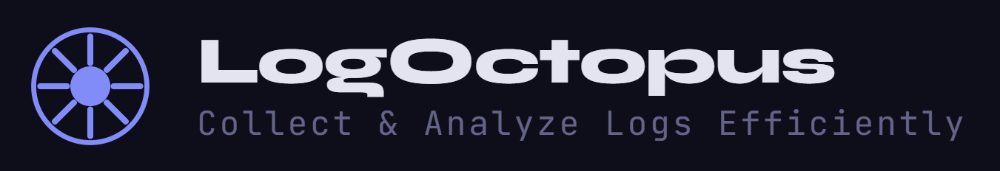
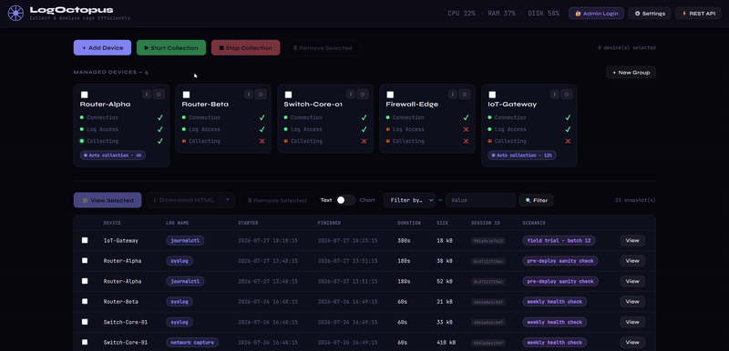

# LogOctopus

<p align="center">
  
</p>

<p align="center">
  <strong>A single place to collect, explore, and analyze evidence from distributed test executions.</strong>
</p>

<p align="center">
  <a href="https://github.com/kkuuba/LogOctopus/actions/workflows/ci.yml">
    
  </a>
  <a href="https://github.com/kkuuba/LogOctopus/blob/main/LICENSE">
    
  </a>
</p>

LogOctopus helps engineers understand why distributed tests fail.
It automatically collects logs, metrics, and system data from remote devices over SSH and organizes everything into a single searchable test session, making root-cause analysis faster and easier.

## Why LogOctopus?

A distributed test fails.

What happens next?

```
❌ Test failed
        ↓
SSH into device 1
Collect logs
        ↓
SSH into device 2
Collect logs
        ↓
Compare timestamps
        ↓
Find the root cause
```

With LogOctopus:

```
❌ Test failed
        ↓
LogOctopus already collected:

✅ Device logs
✅ System metrics
✅ Command outputs
✅ Test session data
        ↓
Open one session and investigate
```

### Use LogOctopus when you need to answer:

> "What happened during this failed test?"

## Live Demo

<div align="center">

[](https://kkuuba.github.io/LogOctopus/)

*👆 Click the preview above to open the interactive demo*

</div>

## Why not ELK / Grafana?

LogOctopus solves a different problem.

| Capability | LogOctopus | ELK | Grafana | Manual SSH |
|---|:---:|:---:|:---:|:---:|
| SSH-based collection | ✅ | ❌ | ❌ | ✅ |
| No agent installation required | ✅ | ❌ | ❌ | ✅ |
| Test session grouping | ✅ | ❌ | ❌ | ❌ |
| Multi-device support | ✅ | ✅ | ✅ | ⚠️ |
| Ready to use quickly | ✅ | ❌ | ❌ | ⚠️ |
| Designed for test debugging | ✅ | ⚠️ | ⚠️ | ❌ |

## Quick Start

### Docker

```bash
git clone https://github.com/kkuuba/LogOctopus.git

cd LogOctopus

nano .env

docker compose up -d
```

Open:

```
Frontend:
http://localhost:8100

Backend:
http://localhost:8050
```

## Features

### Multi-device collection

Collect data from multiple SSH-accessible devices:

* Linux
* Windows
* Raspberry Pi
* Network devices
* NAS systems
* Custom embedded devices

Supports:

* Direct SSH connections
* Gateway/jump hosts
* Network packet captures

### Test-session based investigation

Every collection run creates a session containing:

* Logs
* Metrics
* Device information
* Scenario name
* Timestamps

Example:

```
reboot-test

├── server-01
│   ├── system logs
│   └── CPU metrics
│
├── router-01
│   └── network logs
│
└── device-01
    └── application logs
```

### Log visualization

**Text logs**

* Unified timeline
* Filtering
* Highlighting
* CSV export

**Chart logs**

* Interactive charts
* Zoom and pan
* Device comparison

**Network capture**

* Collect packtes
* Decode packets info 
* Custom tshark dissctors

### Automation integration

Designed for automated tests:

```
Start collection
        ↓
Run test
        ↓
Stop collection
        ↓
Open session results
```

Integrate using REST API with:

* CI/CD pipelines
* Python tests
* Custom automation frameworks

## Architecture

```
              React Frontend
                    |
                 REST API
                    |
              Flask Backend
                    |
                   SSH
                    |
      ------------------------------
      |             |              |
   Device A      Device B       Device C
```

Components:

* React frontend
* Flask backend
* SSH collection layer
* Local snapshot storage

No external database required.

## Configuration

Devices are configured using JSON files.

Example:

```json
{
  "device_name": "Linux Server",
  "ip_address": "192.168.1.10",
  "port": 22,
  "user": "test-user",

  "log_file_configs": [
    {
      "log_name": "system_log",
      "log_file_cmd": "journalctl",
      "log_type": "text"
    }
  ]
}
```

Example configurations:

```
docs/example_configs/
```

Includes:

* Linux
* Windows
* Cisco
* MikroTik
* pfSense
* Proxmox
* Raspberry Pi
* Synology NAS

## REST API

The API allows:

* Start/stop collection
* Manage devices
* Query snapshots
* Retrieve logs

Example:

```bash
curl -X POST http://localhost:8050/api/start-logs-collection \
-H "Content-Type: application/json" \
-d '{"selected_devices":["server-01"],"session_scenario":"test"}'
```

## Planned Features

* Historical test comparison
* Trend analysis
* AI-assisted configuration generation
* Improved device monitoring

## Contributing

Pull requests are welcome.

## License

MIT License
