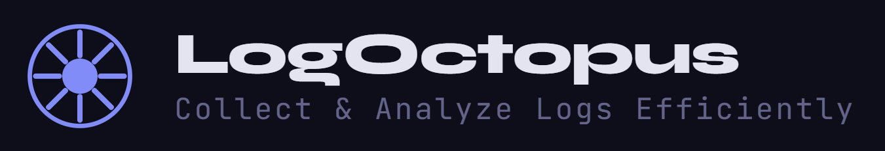
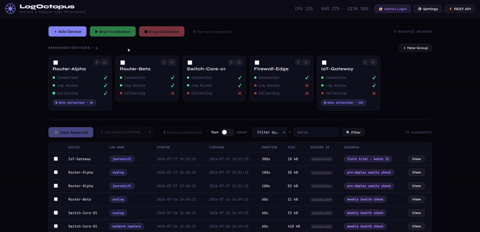

<p align="center">
  
</p>

<p align="center">
  <a href="https://github.com/kkuuba/LogOctopus/actions/workflows/ci.yml">
    
  </a>
  <a href="https://github.com/kkuuba/LogOctopus/blob/main/LICENSE">
    
  </a>
</p>

## One test. Multiple devices. One place to debug.

**LogOctopus** automatically collects logs, metrics, command outputs, and network
captures from every device involved in a test and brings them together in a
single test session.

## Live Demo

<div align="center">



</div>

### Try it yourself

🚀 **[Open the live demo](https://kkuuba.github.io/LogOctopus/)**

No installation required. Explore a preconfigured test session
with logs collected from multiple devices.

## The problem

Multi-device tests often involve multiple machines and devices:

```text
                    ┌──────────────┐
                    │   Test runner│
                    └───────┬──────┘
                            │
             ┌──────────────┼──────────────┐
             ▼              ▼              ▼
        ┌─────────┐    ┌─────────┐    ┌─────────┐
        │ Device A│    │ Device B│    │ Device C│
        └─────────┘    └─────────┘    └─────────┘
```

When the test fails, debugging can look like this:

```text
❌ Test failed
      ↓
SSH into device A
      ↓
Find the relevant logs
      ↓
SSH into device B
      ↓
Find more logs
      ↓
Check system state
      ↓
Compare timestamps
      ↓
Open Wireshark
      ↓
Try to reconstruct what happened
```

This gets painful very quickly.

### With LogOctopus

```text
❌ Test failed
      ↓
Open the test session
      ↓
┌─────────────────────────────────────┐
│ Device A                            │
│   ├── application logs              │
│   └── system metrics                │
│                                     │
│ Device B                            │
│   ├── system logs                   │
│   └── command output                │
│                                     │
│ Device C                            │
│   ├── network logs                  │
│   └── packet capture                │
└─────────────────────────────────────┘
      ↓
Investigate the failure
```

**The goal is simple: make the evidence from a failed multi-device test available in one place.**

---

## Why LogOctopus?

LogOctopus is designed specifically around **test sessions** rather than generic log aggregation.

It answers a simple question:

> **What happened during this test?**

A single session can contain evidence collected from multiple devices:

```text
test-session/
├── server-01/
│   ├── system logs
│   └── CPU / memory metrics
│
├── router-01/
│   └── network logs
│
├── device-01/
│   └── application logs
│
└── network/
    └── packet capture
```

This makes it useful for:

- distributed integration tests
- system testing
- network testing
- embedded-device testing
- hardware validation
- QA automation
- manual troubleshooting
- CI/CD test environments

---

## Features

### 🔌 Multi-device collection

Collect evidence from multiple SSH-accessible devices during the same test session.

Supported environments include:

- Linux
- Windows
- Raspberry Pi
- network devices
- NAS systems
- embedded devices
- custom test infrastructure

Supports:

- direct SSH connections
- gateway / jump hosts
- custom commands
- log file collection
- network packet captures

---

### 🧪 Test-session based investigation

Every collection run creates a session containing information such as:

- scenario name
- timestamps
- device information
- logs
- metrics
- command outputs
- network captures

This lets you investigate a complete test execution instead of searching through unrelated log files.

---

### 📋 Log visualization

Explore collected logs through a unified interface.

Features include:

- unified timeline
- filtering
- highlighting
- CSV export
- interactive charts
- zoom and pan
- device comparison

---

### 📡 Network packet capture

Collect and inspect network traffic as part of a test session.

LogOctopus can collect packet captures and display decoded packet information.

This is particularly useful when investigating failures involving:

- network connectivity
- protocols
- timeouts
- packet loss
- device communication
- distributed systems

---

### 🤖 Automation friendly

LogOctopus can be integrated into automated test workflows through its REST API.

A typical workflow looks like:

```text
Start collection
      ↓
Run automated test
      ↓
Stop collection
      ↓
Open test session
      ↓
Investigate failure
```

This can be integrated with:

- CI/CD pipelines
- Python test suites
- custom test runners
- automation frameworks

---

## Example use case

Imagine a test involving four devices:

```text
Client
   │
   ▼
Router
   │
   ▼
Server
   │
   ▼
Embedded device
```

The test fails with a timeout.

Without LogOctopus, you may need to inspect logs on every device and manually correlate timestamps.

With LogOctopus, the test session can contain:

```text
14:31:07.120  Client       request started
14:31:07.124  Router       packet forwarded
14:31:07.131  Server       request received
14:31:07.145  Embedded     application error
14:31:10.145  Client       timeout
```

The complete timeline is available in one session.

---

## Quick start

### Requirements

- Docker
- Docker Compose
- SSH access to devices you want to collect data from

### 1. Clone the repository

```bash
git clone https://github.com/kkuuba/LogOctopus.git
cd LogOctopus
```

### 2. Configure the environment

Create or edit the `.env` file:

```bash
nano .env
```

See the example configurations in:

```text
docs/example_configs/
```

Example device configurations are provided for:

- Linux
- Windows
- Cisco
- MikroTik
- pfSense
- Proxmox
- Raspberry Pi
- Synology NAS

### 3. Start LogOctopus

```bash
docker compose up -d
```

The default services are available at:

```text
Frontend: http://localhost:8100
Backend:  http://localhost:8050
```

---

## Device configuration

Devices are configured using JSON.

Example:

```json
{
  "device_name": "Linux Server",
  "ip_address": "192.168.1.10",
  "port": 22,
  "user": "test-user",
  "log_file_configs": [
    {
      "log_name": "system_log",
      "log_file_cmd": "journalctl",
      "log_type": "text"
    }
  ]
}
```

See:

```text
docs/example_configs/
```

for additional examples.

---

## REST API

LogOctopus exposes a REST API for integrating collection into automated test environments.

For example, starting a collection:

```bash
curl -X POST http://localhost:8050/api/start-logs-collection \
  -H "Content-Type: application/json" \
  -d '{
    "selected_devices": ["server-01"],
    "session_scenario": "test"
  }'
```

The API can be used to:

- start collection
- stop collection
- manage devices
- query snapshots
- retrieve logs
- integrate LogOctopus with test automation

---

## Architecture

```text
                    ┌─────────────────────┐
                    │    React Frontend   │
                    └──────────┬──────────┘
                               │
                            REST API
                               │
                    ┌──────────▼──────────┐
                    │    Flask Backend    │
                    └──────────┬──────────┘
                               │
                         SSH / Commands
                               │
             ┌─────────────────┼─────────────────┐
             ▼                 ▼                 ▼
        ┌─────────┐       ┌─────────┐       ┌─────────┐
        │ Device A│       │ Device B│       │ Device C│
        └─────────┘       └─────────┘       └─────────┘
```

Main components:

- **React** frontend
- **Flask** backend
- **SSH-based collection layer**
- **local snapshot storage**

No external database is required for the basic setup.

---

## LogOctopus vs. traditional approaches

|                             | LogOctopus | Manual SSH | Generic log platform |
| --------------------------- | :--------: | :--------: | :------------------: |
| Multi-device collection     |      ✅     |     ⚠️     |           ✅          |
| SSH-based collection        |      ✅     |      ✅     |       Usually      |
| No agent required           |      ✅     |      ✅     |       Usually      |
| Test-session grouping       |      ✅     |      ❌     |          ⚠️          |
| Test-oriented investigation |      ✅     |      ❌     |          ⚠️          |
| Network captures            |      ✅     |   Manual   |        Depends       |
| Quick local setup           |      ✅     |      ✅     |      Usually      |
| CI/CD integration           |      ✅     |     ⚠️     |           ✅          |

LogOctopus is **not intended to replace general-purpose observability platforms**.

It focuses on a different problem:

> **Collecting and investigating evidence from distributed test executions.**

---

## Who is LogOctopus for?

LogOctopus is particularly useful if your tests involve multiple machines or physical devices.

### Embedded engineers

Collect application and system logs from embedded Linux devices during automated tests.

### QA / test automation engineers

Automatically collect the evidence needed to investigate failed integration and system tests.

### Network engineers

Collect logs and packet captures from routers, switches, firewalls, servers, and clients involved in a test.

### DevOps / CI engineers

Attach test-session evidence to automated test workflows.

### Hardware validation teams

Keep logs and system information from multiple devices together for every test execution.

---

## Project structure

```text
LogOctopus/
├── backend/             # Flask backend
├── frontend/            # React frontend
├── demo/                # Demo environment
├── docs/                # Documentation and examples
├── tests/               # Tests
├── Dockerfile.backend
├── Dockerfile.frontend
├── docker-compose.yml
└── README.md
```

---

## Roadmap

Planned improvements include:

- [ ] Historical test comparison
- [ ] Test-to-test diffing
- [ ] Trend analysis
- [ ] Improved device monitoring
- [ ] More test-framework integrations
- [ ] AI-assisted configuration generation
- [ ] Improved CI/CD integrations

Have an idea? Open an issue and start a discussion.

---

## Contributing

Contributions are welcome.

If you find a bug, have an idea, or want to add support for another device or test framework:

1. Open an issue.
2. Discuss the proposed change.
3. Fork the repository.
4. Create a feature branch.
5. Submit a pull request.

```bash
git checkout -b feature/my-feature
```

---

## License

LogOctopus is released under the [MIT License](LICENSE).

---

## ⭐ Support the project

If LogOctopus is useful to you:

- ⭐ Star the repository
- 🐛 Report bugs
- 💡 Suggest features
- 🔧 Contribute code
- 📖 Improve the documentation
- 🗣️ Tell other engineers about it

GitHub:

[https://github.com/kkuuba/LogOctopus](https://github.com/kkuuba/LogOctopus)

---

## About

**LogOctopus** is an open-source tool for collecting and investigating logs and other evidence from distributed test executions.

Built for engineers who would rather investigate a failed test than SSH into ten machines to find out what happened.
